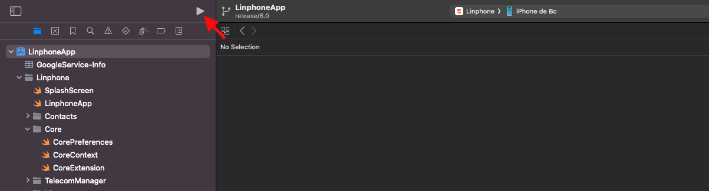
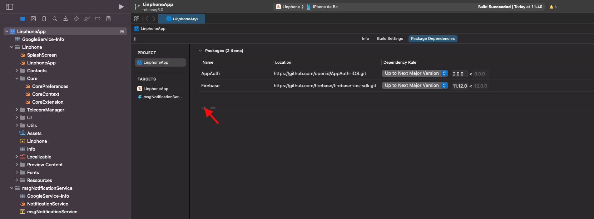
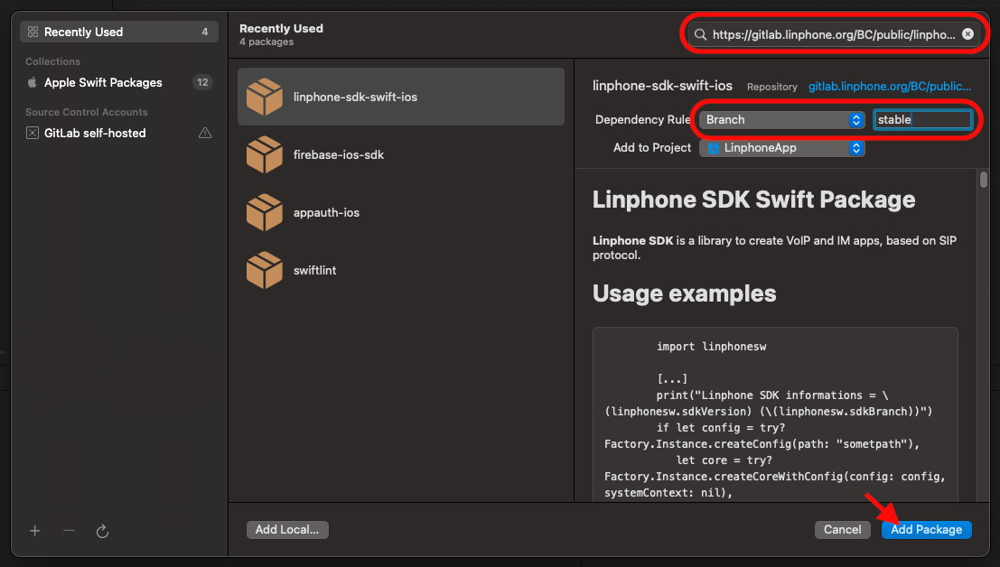
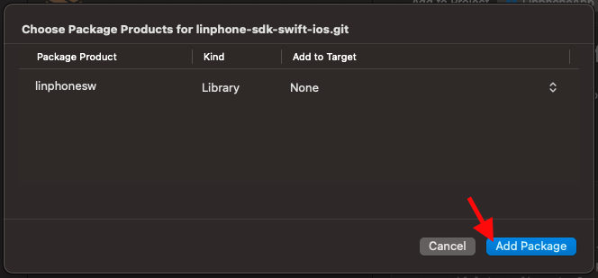
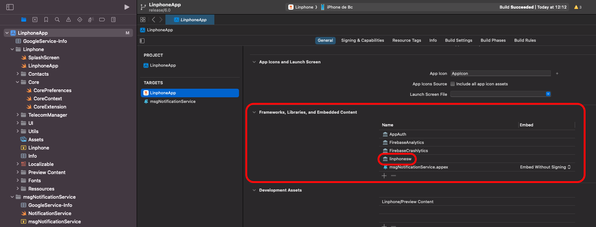
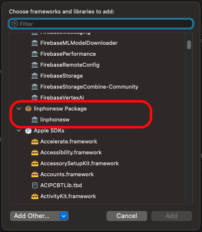
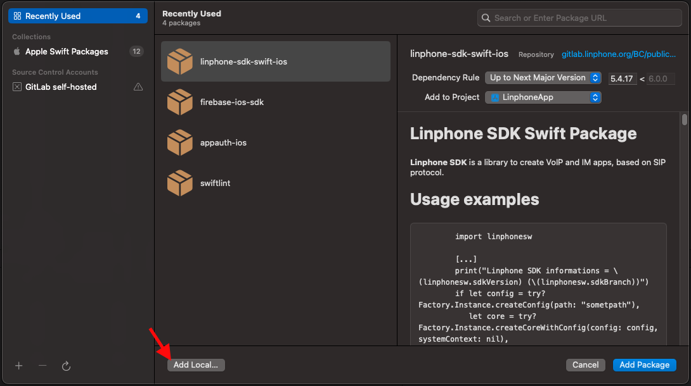
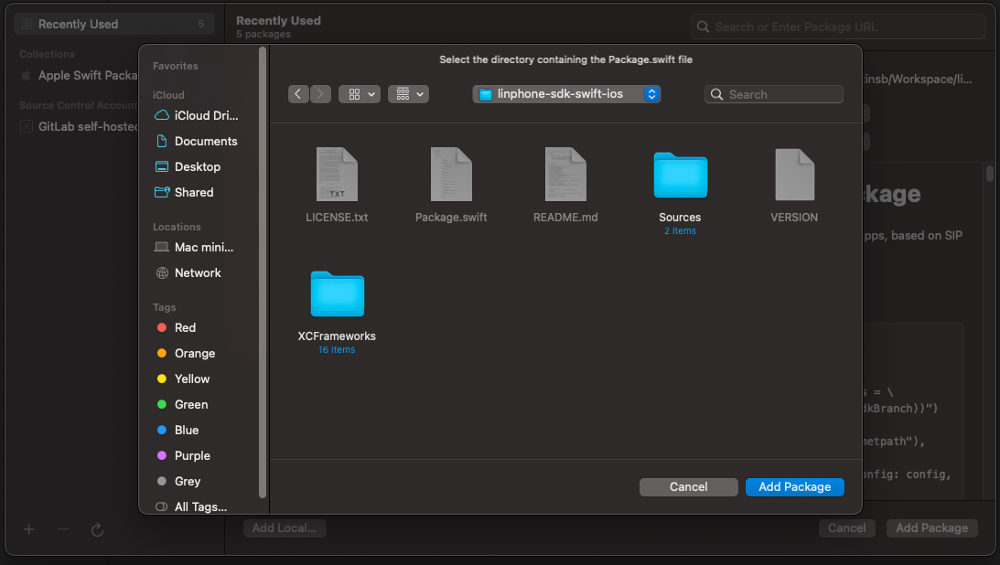

# Mango9 for iOS

Mango9 for iOS is a modified version of the Linphone iOS application. It
provides Mango9 account provisioning, SIP calling, CRM access, contacts, and
Mango9 messaging.

This repository is the corresponding-source location displayed by the Mango9
app. Release tag `ios-6.2.3-build-18` corresponds to Mango9 iOS version 6.2.3,
build 18.

Mango9 modified the upstream Linphone iOS application in 2026. Mango9 is not
affiliated with or endorsed by Belledonne Communications SARL.

## License

The Mango9 application modifications are distributed under the GNU General
Public License, version 3 or (at your option) any later version. See
[LICENSE.txt](LICENSE.txt).

The application includes Linphone SDK 5.5.5, whose open-source distribution is
under GNU Affero General Public License version 3. The exact Swift package
revision is pinned in
`LinphoneApp.xcodeproj/project.xcworkspace/xcshareddata/swiftpm/Package.resolved`.
See [OPEN_SOURCE_NOTICES.md](OPEN_SOURCE_NOTICES.md) for exact dependency source
and license links.

Linphone is originally published by Belledonne Communications SARL. Original
copyright and license notices remain in the source files. The names “Linphone”
and “Belledonne Communications” are used only for required attribution and to
identify the upstream project.

This program is provided without warranty; without even the implied warranty
of merchantability or fitness for a particular purpose.

## Source and build

Clone this repository at the tag matching the installed app. Swift Package
Manager downloads the dependency revisions recorded in `Package.resolved`.

Open `LinphoneApp.xcodeproj` in Xcode, select the `Linphone` scheme, choose an
iOS simulator or provisioned device, and build. Release signing requires your
own Apple team, App ID, application groups, PushKit/APNs configuration, and
service credentials; no private credentials are included in this public
repository.

## Upstream build documentation

## What's new

With Linphone 6.0, we are switching to Swift Package Manager.  
By default, the app uses a remote SPM repository: https://gitlab.linphone.org/BC/public/linphone-sdk-swift-ios.git  
However, if you wish to use a locally built SDK, please refer to the section “Using a local Linphone SDK” below for instructions.

## Building the app

Open `LinphoneApp.xcodeproj` with Xcode to build and run the app.  
The remote SPM is already configured in the app.



# Using a remote Linphone SDK (Optional)

If you want to switch the dependencies back to the remote SPM, here’s how to proceed:

- Go to the Package Dependencies section of your project.



- In the top-right corner of the screen, enter the following URI: https://gitlab.linphone.org/BC/public/linphone-sdk-swift-ios.git
- Change the Dependency Rule to Branch, and enter the keyword stable.
- Click Add Package.



- A new page will open to let you add targets to the library. Normally, this is not necessary, as the dependencies on Linphone and msgNotificationService should already be present.
- Click Add Package.



- Make sure the library appears in the Frameworks, Libraries, and Embedded Content section of all targets that need it.



- Add it manually if needed.



# Using a local linphone SDK (Optional)

- Clone the linphone-sdk repository from our GitLab:
```
git clone git@gitlab.linphone.org:BC/public/linphone-sdk.git
git submodule update --init --recursive
```

- Build the SDK:
```
cmake --preset=ios-sdk -G Ninja -B spm-ios && cmake --build spm-ios
```

- Go to the Package Dependencies section of your project (remove the remote linphonesw SPM from the package dependencies if necessary)


- Click on Add Local.



- Follow your path: yourSdkPath/linphone-sdk/spm-ios/linphone-sdk-swift-ios



- A new page will open to let you add targets to the library. Normally, this is not necessary, as the dependencies on Linphone and msgNotificationService should already be present.
- Click Add Package.


- Make sure the library appears in the Frameworks, Libraries, and Embedded Content section of all targets that need it.


- Add it manually if needed.


# MDM (Mobile Device Management) configuration

Linphone iOS supports managed app configuration via the standard iOS MDM
`com.apple.configuration.managed` mechanism. When the app is deployed through
an MDM server, administrators can push a configuration dictionary that the app
reads at startup and whenever the managed configuration changes at runtime.

The following keys are supported:

| Key           | Type   | Description                                                                                     |
|---------------|--------|-------------------------------------------------------------------------------------------------|
| `xmlConfig`  | String | A Linphone configuration in XML format (same schema as `linphonerc`). Applied via `Config.loadFromXmlString`. |
| `rootCa`     | String | A PEM-encoded root CA certificate used by the Linphone SDK for TLS operations (SIPS, HTTPS provisioning, …). Applied to `core.rootCaData`. |
| `configUri`  | String | URI to a remote provisioning file. When set, it takes precedence over any `config-uri` that may be defined inside `xmlConfig`, and triggers a core restart to fetch the remote configuration. |

Notes:
- All three keys are optional and can be combined.
- If `configUri` is present, it is set last and the core is restarted so that
  remote provisioning takes effect; any `config-uri` value embedded in
  `xmlConfig` is therefore overridden.
- Applying and removing the managed configuration at runtime is supported:
  removing it resets the core to its default configuration and returns to the
  assistant/login screen.

## Testing MDM configuration

Two kinds of tests are provided:

### UI tests (end-to-end)

Located in `LinphoneAppUITests/MDMChatFeatureUITests.swift`. They inject a
managed configuration at launch via the app's DEBUG-only
`UITEST_MDM_CONFIG` launch-environment hook (implemented in
`Linphone/LinphoneApp.swift`), so no `xcrun simctl` setup is needed.

Note: the tests only cover MDM *application* (fresh launch with a managed
config). Live removal of MDM while the app is running cannot be simulated
from an XCUITest process (UserDefaults is per-process and we want the app
to stay alive for a realistic removal scenario), so that path is covered by
manual testing only.

Each MDM test case represents "a fresh device receiving a specific managed
configuration", so we uninstall the app before every test to avoid any
leakage of UserDefaults / keychain / provisioning / accounts between cases.
The wrapper script `scripts/run-mdm-tests.sh` does this for you.

The tests need a real SIP account to reach the main screen (the MDM XML
embeds proxy + auth_info sections) and a remote provisioning URL for the
configUri test. Credentials can be provided three ways — the script
resolves them in this order, highest first:

1. CLI flags: `--username`, `--ha1`, `--domain`, `--configUri` (and
   `--device` for the sim UUID)
2. Shell env vars: `LINPHONE_TEST_USERNAME`, `LINPHONE_TEST_HA1`,
   `LINPHONE_TEST_DOMAIN`, `LINPHONE_TEST_CONFIG_URI`
3. The gitignored file `scripts/test-credentials.env` (copy from `.env.example`)

Examples:

```bash
scripts/run-mdm-tests.sh --device <uuid> --username alice --ha1 <md5-hash> --configUri https://example.com/provisioning.xml
```

```bash
cp scripts/test-credentials.env.example scripts/test-credentials.env
# edit scripts/test-credentials.env, fill in LINPHONE_TEST_USERNAME /
# LINPHONE_TEST_HA1 / LINPHONE_TEST_CONFIG_URI
scripts/run-mdm-tests.sh
```

It will create+boot a throwaway simulator if `DEVICE_UUID` is not set,
uninstall the app before each test, run the tests one at a time with
`-parallel-testing-enabled NO`, and clean up at the end. To reuse an
already-booted simulator:

```bash
DEVICE_UUID=<your-booted-simulator-uuid> scripts/run-mdm-tests.sh
```

`-parallel-testing-enabled NO` avoids flaky UI test launch failures caused by
Xcode spinning up multiple simulator clones in parallel (the test-runner app
can fail to launch on a clone under pressure).

Covered cases:
- `testChatButtonHiddenWithMDMDisableChat` — MDM `xmlConfig` with
  `disable_chat_feature=1`; the test reaches the main screen and asserts the
  chat button is hidden.
- `testConfigUriMDMLandsOnMainPage` — MDM `configUri` pointing at the URL
  supplied via `--configUri` / `LINPHONE_TEST_CONFIG_URI`; the test verifies
  that remote provisioning completes and the app lands on the main screen.

### Unit tests (MDMManager)

Located in `LinphoneAppTests/MDMManagerTests.swift`. The unit test covers
only `rootCa` application: it calls
`MDMManager.shared.applyMdmConfigToCore(core:)` directly on a throwaway
`Core` and asserts `core.rootCaData` matches the MDM-provided certificate.
The `configUri` and `xmlConfig` paths are exercised end-to-end by the UI
tests above.

This requires a **Unit Testing Bundle** target in Xcode (separate from the UI
test target, because `@testable import Linphone` only works from a unit test
bundle):

1. Xcode → File → New → Target → iOS → Unit Testing Bundle
2. Name it `LinphoneAppTests`, set "Target to be Tested" to `LinphoneApp`
3. Add `LinphoneAppTests/MDMManagerTests.swift` to that target

Then run:

```bash
xcodebuild test -project LinphoneApp.xcodeproj -scheme LinphoneAppTests -destination "platform=iOS Simulator,id=$DEVICE_UUID"
```
